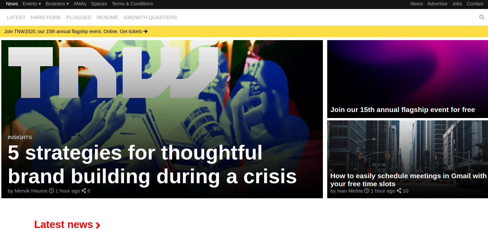

# TheNextWeb Responsive Design

> In this project we created a TheNextWeb website responsive clone.

## Built With

- HTML
- CSS
- VSCode

## Live Demo

[Live Demo Link](https://yors-git.github.io/TNW-website/)

## Authors

👤 **Ahmet Bozacı**

- Github: [@ahmetbozaci ](https://github.com/ahmetbozaci )
- Twitter: [@ahmtbozaci](https://twitter.com/ahmtbozaci)
- Linkedin: [linkedin](https://linkedin.com/in/meron-ogbai-467414198/)

👤 **Jorge Torres**

- Github: [@Yors-git](https://github.com/Yors-git)
- Twitter: [@Yors_82](https://twitter.com/Yors_82) 
- Linkedin: [linkedin](https://www.linkedin.com/in/jtbribiesca/)

## 🤝 Contributing

Contributions, issues and feature requests are welcome!

Feel free to check the [issues page](enter issues url here).

